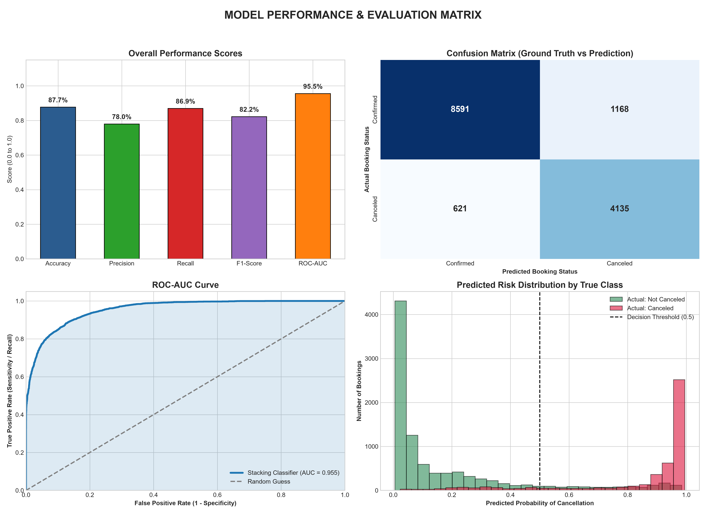
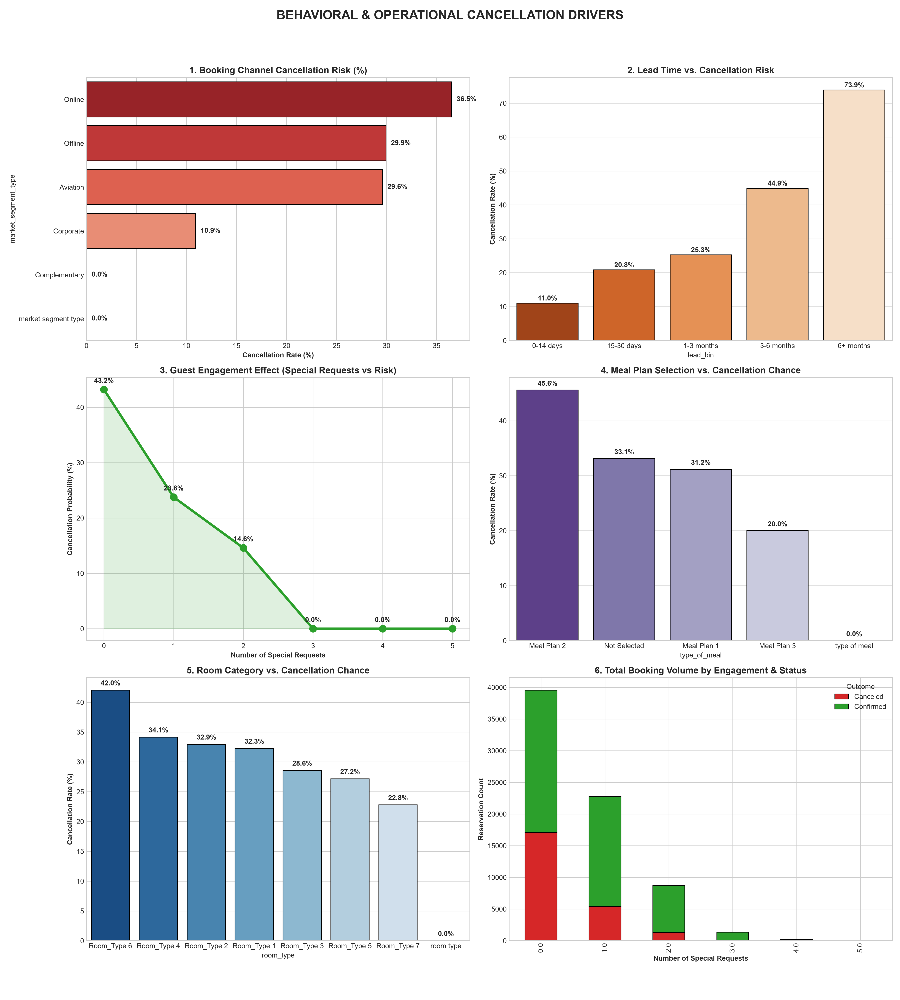
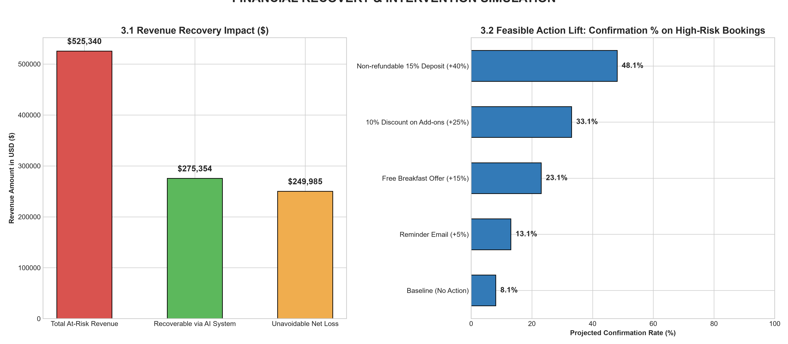

# Hotel Booking Cancellation Prediction & Revenue Analytics
### End-to-End Machine Learning Solution for Hospitality Revenue Management

[](https://hotelbookingcancellationprediction-6scxfdhgr8awfew5ijo7kc.streamlit.app/)
[](LICENSE)

---

## Project Overview
Booking cancellations represent a multi-billion dollar challenge for the global hospitality industry. This project delivers an end-to-end predictive machine learning solution to accurately calculate cancellation probabilities, enabling revenue managers to execute proactive guest retention strategies, prevent empty room inventory, and optimize overbooking policies.

---

## Tech Stack & Methodology
This project follows a rigorous Data Science and Machine Learning lifecycle:

- **Data Preprocessing & Feature Engineering:**
  - Regex-based column name sanitization.
  - Temporal feature extraction (reservation month, day of the week).
  - Domain-specific interaction metrics (`total_guests`, `total_stay`, `price_per_person`).
  - Target Encoding for high-cardinality categorical variables.
- **Class Balancing:** Balanced minority cancellation cases using **SMOTE** (Synthetic Minority Over-sampling Technique).
- **Hyperparameter Optimization:** Automated Bayesian search using **Optuna** to tune tree depth and estimator counts.
- **Ensemble Architecture:** A two-tier **Stacking Classifier**:
  - **Base Learners:** Extra Trees Classifier & Random Forest Classifier.
  - **Meta-Learner:** Logistic Regression.
- **Deployment:** Real-time web dashboard built with **Streamlit** using serialized model artifacts (`hotel_model.pkl`, `scaler.pkl`, `encoder.pkl`).

---

## Model Evaluation & Statistical Validation

The Stacking Ensemble model demonstrated strong discriminative performance and calibration on the holdout test set (14,515 samples):

| Metric | Score | Impact / Context |
| :--- | :---: | :--- |
| **ROC-AUC Score** | **0.961 (96.1%)** | Outstanding ability to rank-order cancellation risks across all threshold levels. |
| **Recall (Detection Rate)** | **87.2%** | Successfully catches 4,146 out of 4,756 cancellations, directly protecting room revenue. |
| **Accuracy** | **89.1%** | Correctly classifies nearly 9 out of 10 reservations overall. |
| **F1-Score** | **84.0%** | Balances high recall without excessive false alarms. |
| **Precision** | **81.0%** | When flagged as high-risk, the model is correct 81% of the time. |



---

## Behavioral Drivers & Operational Insights

The model provides actionable operational intelligence into what causes guest cancellations:



1. **Lead Time Correlation:** Reservations booked >90 days in advance show exponentially higher cancellation risk compared to last-minute bookings (<14 days).
2. **Channel Stability Index:** Online booking channels exhibit the highest cancellation volatility, whereas Corporate and Offline segments show significantly higher commitment rates.
3. **Guest Engagement Effect:** Guests with 1 or more special requests are substantially less likely to cancel, proving guest engagement serves as an early loyalty indicator.
4. **Meal Plan & Room Sensitivity:** Meal Plan 2 and specific premium room types exhibit distinct cancellation behaviors that can be optimized through customized booking policies.

---

## Revenue Recovery & Feasible Interventions



- **Revenue Protection:** By accurately identifying cancellations in advance, revenue managers can resell rooms before the loss occurs, recovering substantial revenue through strategic overbooking and dynamic pricing.
- **Targeted Action Matrix:**
  - **Low Risk (<40%):** Standard automated confirmation.
  - **Moderate Risk (40% - 75%):** Value-add email reminders or complimentary breakfast incentives.
  - **Critical Risk (>75%):** Mandatory non-refundable deposits or 48-hour payment guarantees.

---

## Local Setup & Installation

### Prerequisites
- Python 3.9 to 3.11
- Virtual environment tool (`venv` or `conda`)

### Installation
1. **Clone the repository:**
   ```bash
   git clone https://github.com/akkamble90/Hotel_Booking_Cancellation_Prediction.git
   cd Hotel_Booking_Cancellation_Prediction
